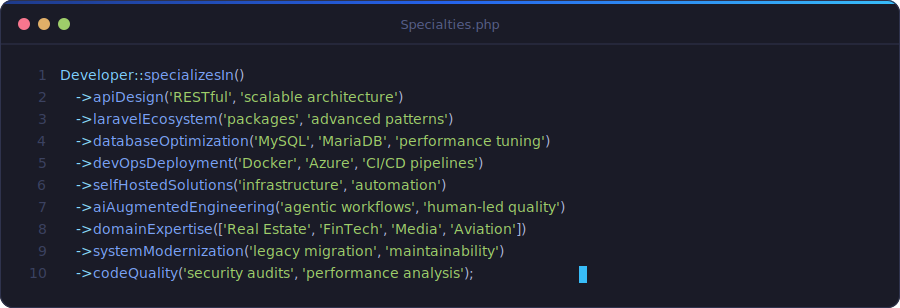
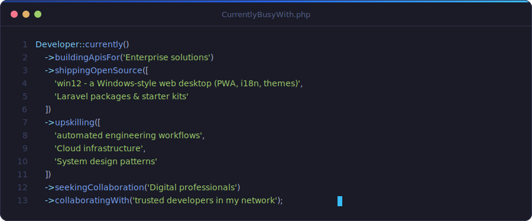
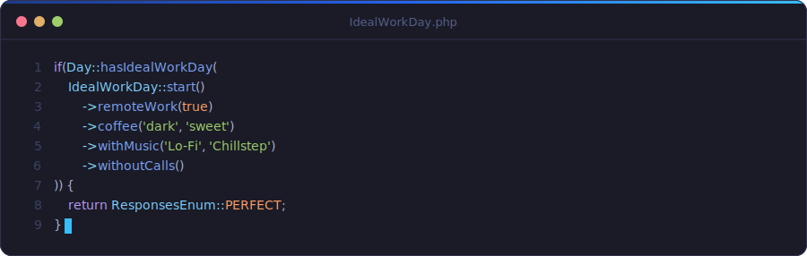
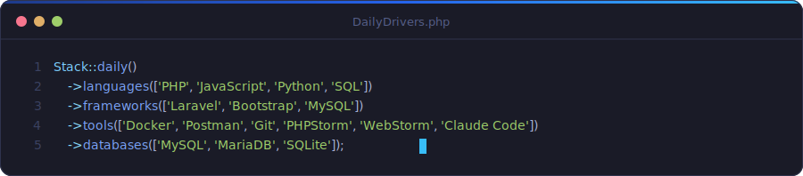
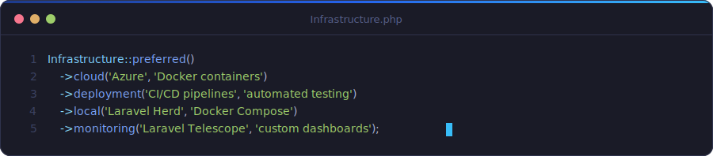
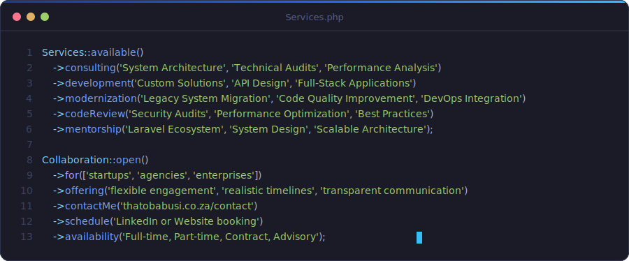
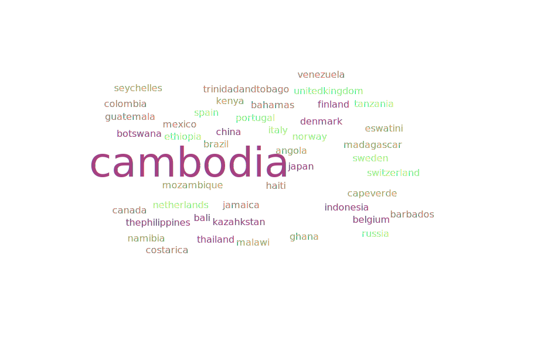

<!--
**thatobabusi/thatobabusi** is a ✨ _special_ ✨ repository because its `README.md` (this file) appears on your GitHub profile.
-->

  

 

**[🌍 Visit the Website](https://thatobabusi.co.za)** · **[📦 Releases](https://github.com/thatobabusi/thatobabusi/releases)** · **[📚 Docs](docs/README.md)** · **[📜 Changelog](docs/CHANGELOG.md)**

<h1 align="center"> 🧭 Summary</h1>

🎓 Staffordshire University Alumni | 🎓 Asia Pacific University Alumni | 🎓 Mater Spei College Alumni  
‍🚀 13+ Years developing systems for various industries such as:  
✈️ Aviation & Auditing |
🚢 Transport & Logistics |
🧑‍🤝‍🧑 Human Resource Management |  
📺 Media and Advertising |
🔬 Research   
🛠️ I use daily: .**php**, .**blade**.php, .**laravel**, .**js**, .**html**, .**css**, .**mysql**   
🌱 I'm currently: Building open-source products, and pairing automation workflows with battle-tested engineering.
   
**🤝 Let's Connect**
 

 <strong>Website:</strong> <a href="https://thatobabusi.co.za">thatobabusi.co.za</a>
 <strong>Email:</strong> <a href="https://thatobabusi.co.za/contact">thatobabusi.co.za/contact</a>
 <strong>Services:</strong> Software Development | Digital Solutions | Africa first solutions

<h2 align="center"> 🔭 Tech Stack </h2>

  

<h2 align="center"> 📈 GitHub Stats </h2>

&nbsp;

  

 

  

  

<h2 align="center"> 🚀 Featured Projects </h2>

### Public & Notable Projects

<table align="center">
  <tr>
    <td align="center" width="45%">
      <h3>🖥️ <a href="https://github.com/thatobabusi/win12" target="_blank">win12 — Web Desktop</a></h3>
      
An open-source Windows-style desktop that runs in the browser. Installable PWA with a boot/login experience, theming (including an Ubuntu theme), and full i18n across 5 locales.

      
<strong>Stack:</strong> JavaScript, PWA, GitHub Actions

    </td>
    <td align="center" width="5%"></td>
    <td align="center" width="45%">
      <h3>🎵 <a href="https://www.edensfrequency.online/" target="_blank">EdensFrequency</a></h3>
      
Creative platform for music production, sound design, and audio-visual conceptualization. Full-spectrum production across genres including boom bap, soul, and experimental soundscapes.

      
<strong>Stack:</strong> Laravel, Bootstrap 5, MySQL

    </td>
  </tr>
  <tr>
    <td colspan="3" height="20"></td>
  </tr>
  <tr>
    <td align="center" width="45%">
      <h3>🏠 <a href="https://thatobabusi.co.za/professional/my-portfolio" target="_blank">Laravel Real Estate Manager</a></h3>
      
Modern platform for real estate agencies with agent dashboards, buyer/tenant engagement, property marketing, ratings, and messaging features.

      
<strong>Stack:</strong> Laravel, MySQL, Bootstrap

    </td>
    <td align="center" width="5%"></td>
    <td align="center" width="45%">
      <h3>💰 <a href="https://thatobabusi.co.za/professional/my-portfolio" target="_blank">Laravel Expense Manager</a></h3>
      
Self-hosted financial tracking application. Track expenses, incomes, accounts, assets and investments. Your money, on a dashboard you actually own.

      
<strong>Stack:</strong> Laravel, MySQL, Bootstrap

    </td>
  </tr>
  <tr>
    <td colspan="3" height="20"></td>
  </tr>
  <tr>
    <td align="center" width="45%">
      <h3>🎬 <a href="https://thatobabusi.co.za/professional/my-portfolio" target="_blank">CrateLab</a></h3>
      
Self-hosted music production workstation. Sample management, stem separation, MIDI composition, and instrument creation without external SaaS dependencies.

      
<strong>Stack:</strong> Laravel, Python, MySQL

    </td>
    <td align="center" width="5%"></td>
    <td align="center" width="45%">
      <h3>🎬 <a href="https://thatobabusi.co.za/professional/my-portfolio" target="_blank">Personal Home Media Manager</a></h3>
      
Self-hosted media organization system for home networks. Organize and play movies, TV series, music, videos, and photos stored locally.

      
<strong>Stack:</strong> Laravel, Python, MySQL

    </td>
  </tr>
  <tr>
    <td colspan="3" height="20"></td>
  </tr>
  <tr>
    <td align="center" width="45%">
      <h3>🛍️ <a href="https://thatobabusi.co.za/professional/my-portfolio" target="_blank">All Kasi Showcase</a></h3>
      
E-commerce showcase for premium sportswear brand featuring product catalog, brand storytelling, video content, and customer reviews.

      
<strong>Stack:</strong> Laravel, Bootstrap, MySQL

    </td>
    <td align="center" width="5%"></td>
    <td align="center" width="45%">
      <h3>📦 <a href="https://thatobabusi.co.za/professional/my-portfolio" target="_blank">Laravel Packages Collection</a></h3>
      
Growing library of Laravel packages for development. Includes cheat sheets, deployment tools, generators, and API helpers.

      
<strong>Stack:</strong> Laravel, PHP

    </td>
  </tr>
  <tr>
    <td colspan="3" height="20"></td>
  </tr>
  <tr>
    <td align="center" width="45%">
      <h3>🏗️ <a href="https://thatobabusi.co.za/professional/my-portfolio" target="_blank">Laravel Core UI Starter Kit</a></h3>
      
Pre-configured Laravel development foundation. Includes admin dashboard, DataTables, role-based access control, and database browser.

      
<strong>Stack:</strong> Laravel, Bootstrap, MySQL

    </td>
    <td align="center" width="5%"></td>
    <td align="center" width="45%">
      <h3>📚 <a href="https://thatobabusi.co.za/professional/my-portfolio" target="_blank">Full Portfolio</a></h3>
      
More projects, case studies, and write-ups — including SEAMS (Smart Electronic Aviation Management System) and enterprise work across 5 industries.

      
<strong>View:</strong> thatobabusi.co.za

    </td>
  </tr>
</table>

<h2  align="center"> 💻 My Work</h2>

I'm actively building software solutions and creating digital experiences that matter. My current obsession is *African Solutions for African Challenges*.

**[View All Repositories →](https://github.com/thatobabusi?tab=repositories)**

<h2 align="center"> 👨‍💻 About Me</h2>

  
<b>Specialties</b>

<h2 align="center"> ⚡I specialize in</h2>

  
<b>Busy with</b>

<h2 align="center"> 😀 What's keeping me busy</h2>

  
<b>Preferences</b>

<h2 align="center"> 💖 An Ideal Work Day</h2>

  
<b>Tech & Tools</b>

<h2 align="center"> 🛠️ Development Environment & Preferences</h2>

### Daily Drivers

### Infrastructure & Deployment

### Development Philosophy
- **Code Quality:** PSR-12 standards, clean architecture, SOLID principles
- **Performance:** Database optimization, caching strategies, query analysis
- **Security:** Input validation, SQL injection prevention, secure authentication
- **Maintainability:** Self-documenting code, comprehensive tests, clear documentation

  
<b>Let's work</b>

  
<b>📊 Statistics</b>

# 📊 Impact Stats (2026)

<!-- STATS:START -->
| Metric | Value |
|--------|-------|
| ⭐ Experience | 13+ years systems development across 5 industries |
| 📦 Public Repos | 22 on GitHub |
| 👥 GitHub Followers | 21 |
| 📝 Published Articles | 13 articles on [thatobabusi.co.za](https://thatobabusi.co.za/blog) |
| 💻 Active Projects | 10+ (win12, IPTV, Full-Stack Upskilling, +7 more) |
| 📊 Portfolio Projects | 9 public/notable projects showcased |
| 🌍 Industries Served | Aviation & Auditing, Transport & Logistics, HRM, Media, Research |
| 🏆 BBBEE Status | Level 1 - 100% Black-owned |
| 🛠️ Tech Stack | 14+ technologies (PHP, Laravel, Python, Docker, Azure, +10 more) |
| 🎓 Certifications | Staffordshire University, Asia Pacific University, Mater Spei College |
<!-- STATS:END -->

  
<b>Articles & Publications</b>

# 📝 Articles & Publications

**Latest:** Published on [thatobabusi.co.za/blog](https://thatobabusi.co.za/blog)

| 📖 Article | 🏷️ Topic |
|:-----------|:--------:|
| [PHP Is Not Dead: Dispelling The Myths](https://thatobabusi.co.za/blog/php-is-not-dead-dispelling-the-myths) | `PHP` |
| [In Defense Of The Repository Pattern](https://thatobabusi.co.za/blog/in-defense-of-the-repository-pattern) | `Architecture` |
| [How To Combat Context Switching For Maximum Developer Productivity](https://thatobabusi.co.za/blog/how-to-combat-context-switching-for-maximum-developer-productivity) | `Productivity` |
| [Not My Fault, Still My Problem: Owning Outcomes Beyond Responsibility](https://thatobabusi.co.za/blog/not-my-fault-still-my-problem-owning-outcomes-beyond-responsibility) | `Mindset` |
| [When Explanation Meets Perception: The Real Difference Between Reasons and Excuses](https://thatobabusi.co.za/blog/when-explanation-meets-perception-the-real-difference-between-reasons-and-excuses) | `Mindset` |
| [The Art Of Taking An L](https://thatobabusi.co.za/blog/the-art-of-taking-an-l) | `Mindset` |

**🆕 Latest from the blog** (auto-synced daily)

<!-- LATEST-POSTS:START -->
| 📖 Post | 🏷️ Topic |
|:--------|:--------:|
| [thatobabusi.co.za | Dust Review: Youtube’s Hidden Sci-Fi Cinema Universe](https://thatobabusi.co.za/blog-legacy-single/dust-review-youtubes-hidden-scifi-cinema-universe) | `Review` |
| [thatobabusi.co.za | 3 Body Problem Review: The Show That Starts With Science And Slowly Breaks Your Brain](https://thatobabusi.co.za/blog-legacy-single/3-body-problem-review-the-show-that-starts-with-science-and-slowly-breaks-your-brain) | `Review` |
| [thatobabusi.co.za | Snowpiercer Review: The Train Never Stops And Neither Does The Drama](https://thatobabusi.co.za/blog-legacy-single/snowpiercer-review-the-train-never-stops-and-neither-does-the-drama) | `Review` |
| [thatobabusi.co.za | Apex Review: Charlize Theron Reminds Everyone That Going Into The Wilderness Alone Is Already A Bad Idea](https://thatobabusi.co.za/blog-legacy-single/apex-review-charlize-theron-reminds-everyone-that-going-into-the-wilderness-alone-is-already-a-bad-idea) | `Review` |
| [thatobabusi.co.za | Designated Survivor Review: The Political Thriller That Asks One Terrifying Question](https://thatobabusi.co.za/blog-legacy-single/designated-survivor-review-the-political-thriller-that-asks-one-terrifying-question) | `Review` |
| [thatobabusi.co.za | Black Mirror Review: The Show That Made Everyone Side-Eye Their Own Phone](https://thatobabusi.co.za/blog-legacy-single/black-mirror-review-the-show-that-made-everyone-sideeye-their-own-phone) | `Review` |
<!-- LATEST-POSTS:END -->

**🔗 Subscribe:** [Blog RSS Feed](https://thatobabusi.co.za/blog)

  
<b>Reading</b>

# 📚 Books I'm reading

| 📕 Book | ✍️ Author | Status |
|:--------|:----------|:------:|
| A Thousand Splendid Suns | Khaled Hosseini | ✅ Finished |
| The Kite Runner | Khaled Hosseini | ✅ Finished |
| I Am Malala | Malala Yousafzai & Christina Lamb | ✅ Finished |
| White Ninja | Eric van Lustbader | ✅ Finished |
| Black Blade | Eric van Lustbader | ✅ Finished |
| Zero | Eric van Lustbader | ✅ Finished |
| The Jian | Eric van Lustbader | 📖 Reading |
| Good Strategy Bad Strategy: The Difference and Why It Matters | Richard P. Rumelt | 📖 Reading |

  
<b>Travels</b>

<h2 align="center"> 🛫  The Adventure So Far </h2>

  
<b>Travel Wishlist</b>

<h2 align="center"> ✈️ Dream Destinations</h2>

<!--
# 🔍 Inspiration

    
Md. Sharif Alam - <a name="github-link" href="https://github.com/Priom7">GitHub and articles</a> 

- Md. Sharif Alam | <a name="github-link" href="https://github.com/Priom7>Md. Sharif Alam</a>
- https://towardsdev.com/instantly-generate-laravel-apis-from-your-database-schema-a-powerful-cli-tool-dcae914b3f24
- https://medium.com/@priom7197/how-i-document-and-track-my-work-with-just-0-01-effort-as-a-software-developer-b99ca75fe73d
- https://pub.towardsai.net/revolutionizing-database-interactions-with-ai-powered-sql-query-generation-da0ac8302207
- https://towardsdev.com/%EF%B8%8F-run-ai-chatbot-locally-with-react-ollama-deepseek-llm-6e762e076f2f
- https://medium.com/@priom7197/the-gatekeeper-of-knowledge-in-corporate-culture-a-reflection-from-the-mid-career-frontlines-d5bcdf44204b
- https://towardsdev.com/custom-pdf-generator-for-question-papers-json2pdf-browserless-rest-api-ad0356cf1ca4
- https://medium.com/@priom7197/%EF%B8%8Fphonetic-algorithms-to-optimize-search-engines-spell-correction-suggestions-and-more-65e06dc991d0
- https://towardsdev.com/laravel2doc-generate-sequence-diagrams-from-your-laravel-application-in-seconds-1-2-84bf8ac8a193

-->
