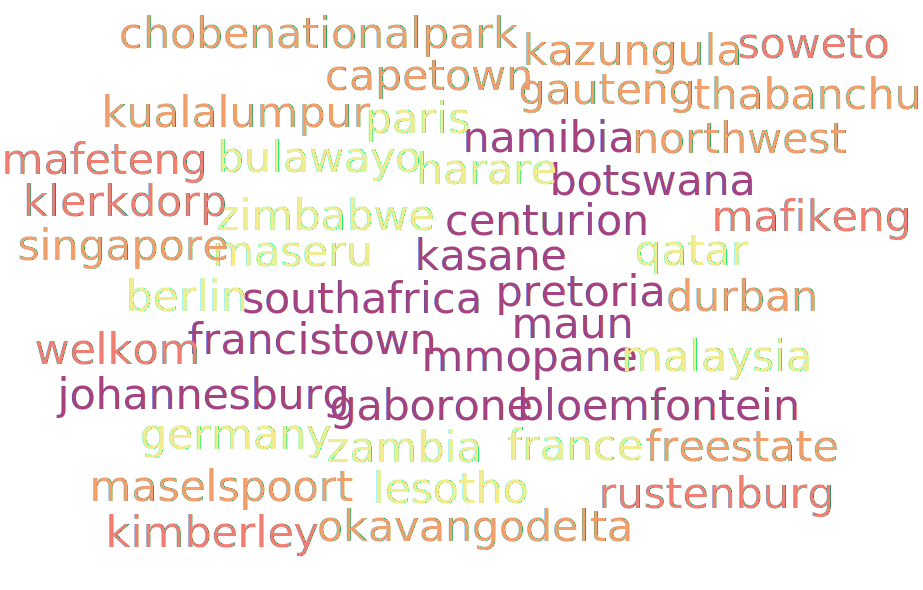

<!--
**thatobabusi/thatobabusi** is a ✨ _special_ ✨ repository because its `README.md` (this file) appears on your GitHub profile.
-->

<h1 align="center"> 👨‍💻 Thato Babusi</h1>

<p align="center">
    A seasoned Systems Developer building scalable digital solutions.

  <br> 
  
</p>

<hr>

<h1 align="center"> 👨‍ Summary</h1>

<div align="center">

🎓 Staffordshire University Alumni | 🎓 Asia Pacific University Alumni | 🎓 Mater Spei College Alumni <br/>
‍🚀 13+ Years developing systems for various industries such as: <br/>
✈️ Aviation & Auditing |
🚢 Transport & Logistics |
🧑‍🤝‍🧑 Human Resource Management |  
📺 Media and Advertising |
🔬 Research <br/><br/>
🛠️ I use daily: .**php**, .**blade**.php, .**laravel**, .**js**, .**html**, .**css**, .**mysql** <br/><br/>
🌱 I’m currently: Expanding expertise in modern web frameworks and cloud solutions.
<br/> <br/>
**🤝 Let's Connect**
<br/><a href="https://github.com/thatobabusi" target="_blank"></a>
<a href="https://www.linkedin.com/in/thatobabusi" target="_blank"></a>

**🏢 Business**
<br/><strong>Email:</strong> <a href="mailto:thatobabusi@yahoo.com">thatobabusi@yahoo.com</a>
<br/><strong>Website:</strong> <a href="https://thatobabusi.co.za">thatobabusi.co.za</a>
<br/><strong>Services:</strong> Software Development | Digital Solutions | Africa first solutions

</div>

<hr>

<h2 align="center"> 🔭 Tech Stack </h2>

<p align="center">
  &nbsp;&nbsp;&nbsp;
  &nbsp;&nbsp;&nbsp;
  &nbsp;&nbsp;&nbsp;
  &nbsp;&nbsp;&nbsp;
  &nbsp;&nbsp;&nbsp;
  &nbsp;&nbsp;&nbsp;
  &nbsp;&nbsp;&nbsp;
  &nbsp;&nbsp;&nbsp;
  &nbsp;&nbsp;&nbsp;
  &nbsp;&nbsp;&nbsp;
  &nbsp;&nbsp;&nbsp;
  &nbsp;&nbsp;&nbsp;
  &nbsp;&nbsp;&nbsp;
  &nbsp;&nbsp;&nbsp;
</p>

<p align="center">
  <a href="https://en.wikipedia.org/wiki/Windows">
    
  </a>
  <a href="https://en.wikipedia.org/wiki/MacOS">
    
  </a>
  <a href="https://en.wikipedia.org/wiki/Linux">
    
  </a>
  <a href="https://code.visualstudio.com/">
    
  </a>
  <a href="https://code.visualstudio.com/">
    
  </a>
  <a href="https://code.visualstudio.com/">
    
  </a>
  <a href="https://code.visualstudio.com/">
    
  </a>
</p>

<hr>

<h2 align="center"> 🚀 Featured Projects </h2>

<div align="center">

### Public & Notable Projects

<table align="center">
  <tr>
    <td align="center" width="45%">
      <h3>🎵 <a href="https://www.edensfrequency.online/" target="_blank">EdensFrequency</a></h3>
      <p>Creative platform for music production, sound design, and audio-visual conceptualization. Full-spectrum production across genres including boom bap, soul, and experimental soundscapes.</p>
      <p><strong>Stack:</strong> Laravel, Bootstrap 5, MySQL</p>
    </td>
    <td align="center" width="5%"></td>
    <td align="center" width="45%">
      <h3>🏠 <a href="https://thatobabusi.co.za/professional/my-portfolio" target="_blank">Laravel Real Estate Manager</a></h3>
      <p>Modern platform for real estate agencies with agent dashboards, buyer/tenant engagement, property marketing, ratings, and messaging features.</p>
      <p><strong>Stack:</strong> Laravel, MySQL, Bootstrap</p>
    </td>
  </tr>
  <tr>
    <td colspan="3" height="20"></td>
  </tr>
  <tr>
    <td align="center" width="45%">
      <h3>💰 <a href="https://thatobabusi.co.za/professional/my-portfolio" target="_blank">Laravel Expense Manager</a></h3>
      <p>Self-hosted financial tracking application. Track expenses, incomes, accounts, assets and investments. Your money, on a dashboard you actually own.</p>
      <p><strong>Stack:</strong> Laravel, MySQL, Bootstrap</p>
    </td>
    <td align="center" width="5%"></td>
    <td align="center" width="45%">
      <h3>🎬 <a href="https://thatobabusi.co.za/professional/my-portfolio" target="_blank">CrateLab</a></h3>
      <p>Self-hosted music production workstation. Sample management, stem separation, MIDI composition, and instrument creation without external SaaS dependencies.</p>
      <p><strong>Stack:</strong> Laravel, Python, MySQL</p>
    </td>
  </tr>
  <tr>
    <td colspan="3" height="20"></td>
  </tr>
  <tr>
    <td align="center" width="45%">
      <h3>✈️ <a href="https://thatobabusi.co.za/professional/my-portfolio" target="_blank">SEAMS</a></h3>
      <p>Smart Electronic Aviation Management System. Enterprise software for aircraft charter operations and aviation auditing services.</p>
      <p><strong>Stack:</strong> PHP, Laravel, MySQL</p>
    </td>
    <td align="center" width="5%"></td>
    <td align="center" width="45%">
      <h3>🛍️ <a href="https://thatobabusi.co.za/professional/my-portfolio" target="_blank">All Kasi Showcase</a></h3>
      <p>E-commerce showcase for premium sportswear brand featuring product catalog, brand storytelling, video content, and customer reviews.</p>
      <p><strong>Stack:</strong> Laravel, Bootstrap, MySQL</p>
    </td>
  </tr>
</table>

📚 **More projects available in my <a href="https://thatobabusi.co.za/professional/my-portfolio" target="_blank">portfolio</a>** including Laravel Packages Collection, Personal Home Media Manager, and Laravel Core UI Starter Kit.

</div>

<hr>

<div align="center">
<h2 align="center"> 👨‍💻 About Me</h2>

<details>
  <summary><b>Specialties</b></summary>

<h2 align="center"> ⚡I specialize in</h2>

<div align="left">

```
Developer::specializesIn()
    ->modernizingLegacySystems()
    ->withScalableArchitecture()
    ->deliveringProjectsEndToEnd()
    ->withFocusOn('maintainability')
    ->conductingTechnicalInspections()
    ->evaluatingSystemsThoroughly()
    ->buildingLaravelPackages()
    ->extendingModulesGracefully();

```
</div>

</details>

<details>
  <summary><b>Busy with</b></summary>

<h2 align="center"> 😀 What's keeping me busy</h2>

<div align="left">

```
Developer::currently()
    ->buildingApisFor('Enterprise solutions')
    ->managingCompanies([
        'ThatoBabusiDev - Software Consulting',
        'DigitalGardenMedia - Bespoke Digital Solutions'
    ])
    ->upskilling([
        'Modern web frameworks',
        'Cloud infrastructure',
        'System design patterns'
    ])
    ->workingOn([
        'Client projects',
        'Product development',
        'Team collaboration'
    ])
    ->seekingCollaboration('Digital professionals')
    ->collaboratingWith('trusted developers in my network');
```
</div>

</details>

<details>
  <summary><b>Preferences</b></summary>

<h2 align="center"> 💖 An Ideal Work Day</h2>

<div align="left">

```
if(Day::hasIdealWorkDay(
    IdealWorkDay::start()
        ->remoteWork(true)
        ->coffee('dark', 'sweet')
        ->withMusic('Lo-Fi', 'Chillstep')
        ->withoutCalls()
)) {
    return ResponsesEnum::PERFERCT;
}
```
</div>

</details>


<div align="center">
<details>
  <summary><b>Let's work</b></summary>

<div align="left">

```
if (You::lookingFor('PHP Developer')) {

    $requirements = Requirements::for('Systems Developer')
                        ->withExperience(12)
                        ->stack('PHP')
                        ->usingDaily([
                            '.php', '.blade.php', '.js', '.html', '.css', '.sqlite', '.json',
                        ])
                        ->connectVia([
                            'LinkedIn',
                            'GitHub',
                            'Twitter',
                            'Mail',
                        ]);
    
    return Developer::withExperienceIn(stack: 'PHP', experience: 12)
        ->withExperienceIn(stack: 'Laravel', experience: 12)
        ->whoCan(['build APIs', 'design clean architecture', 'maintain systems'])
        ->reachOutOn('LinkedIn', 'GitHub', 'Email')
        ->letsBridgeTheDivide()
        ->letsTalk()
        ->ifWeComeToAnAgreement(function () {
            return Plan::make()
                ->withTimeline('realistic')
                ->withGoals(['solve problems', 'create value', 'scale impact']);
    });
}
```
</div>

</details>
</div>


<details>
  <summary><b>📊 Statistics</b></summary>

<div align="center">

# 📊 Quick Stats (2026)

| Metric | Value |
|--------|-------|
| 💻 Active Projects | 10+ |
| 📝 Published Articles | 6+ on thatobabusi.co.za |
| ⭐ Years Experience | 13+ years systems development |
| 🌍 BBBEE Status | Level 1 - 100% Black-owned |

</div>

</details>

<details>
  <summary><b>Articles & Publications</b></summary>

<div align="center">

# 📝 Articles & Publications

**Latest:** Published on [thatobabusi.co.za/blog](https://thatobabusi.co.za/blog)

- 📖 <a href="https://thatobabusi.co.za/blog/php-is-not-dead-dispelling-the-myths">PHP Is Not Dead: Dispelling The Myths</a>
- 📖 <a href="https://thatobabusi.co.za/blog/how-to-combat-context-switching-for-maximum-developer-productivity">How To Combat Context Switching For Maximum Developer Productivity</a>
- 📖 <a href="https://thatobabusi.co.za/blog/in-defense-of-the-repository-pattern">In Defense Of The Repository Pattern</a>
- 📖 <a href="https://thatobabusi.co.za/blog/not-my-fault-still-my-problem-owning-outcomes-beyond-responsibility">Not My Fault, Still My Problem: Owning Outcomes Beyond Responsibility</a>
- 📖 <a href="https://thatobabusi.co.za/blog/when-explanation-meets-perception-the-real-difference-between-reasons-and-excuses">When Explanation Meets Perception: The Real Difference Between Reasons and Excuses</a>
- 📖 <a href="https://thatobabusi.co.za/blog/the-art-of-taking-an-l">The Art Of Taking An L</a>

**🔗 Subscribe:** [Blog RSS Feed](https://thatobabusi.co.za/blog)

</div>

</details>

<details>
  <summary><b>Reading</b></summary>

<div align="center">

# 📚 Books I'm reading


-  [x] <br/>
-  [x] <br/>
-  [x] <br/>
-  [x] <br/>
-  [x] <br/>
-  [x] <br/>
-  [ ] <br/>
-  [ ] <br/>

</div>
</details>


<details>
  <summary><b>Travels</b></summary>

<div align="center">

<h2 align="center"> 🛫  The Adventure So Far </h2>



</div>
</details>

<details>
  <summary><b>Travel Wishlist</b></summary>

<div align="center">

<h2 align="center"> ✈️ Dream Destinations</h2>


</div>
</details>


</div>

<hr>


<div align="center">

```

------------------------------------------------------------------------------------------------------------------------
                  _____ _           _          ____        _               _
                 |_   _| |__   __ _| |_ ___   | __ )  __ _| |__  _   _ ___(_)
                   | | | '_ \ / _` | __/ _ \  |  _ \ / _` | '_ \| | | / __| |
                   | | | | | | (_| | || (_) | | |_) | (_| | |_) | |_| \__ \ |
                   |_| |_| |_|\__,_|\__\___/  |____/ \__,_|_.__/ \__,_|___/_|
                
------------------------------------------------------------------------------------------------------------------------
```

</div>

<hr>

<!--
# 🔍 Inspiration
<details>
    <summary>Md. Sharif Alam - <a name="github-link" href="https://github.com/Priom7">GitHub and articles</a> </summary>

- Md. Sharif Alam | <a name="github-link" href="https://github.com/Priom7>Md. Sharif Alam</a>
- https://towardsdev.com/instantly-generate-laravel-apis-from-your-database-schema-a-powerful-cli-tool-dcae914b3f24
- https://medium.com/@priom7197/how-i-document-and-track-my-work-with-just-0-01-effort-as-a-software-developer-b99ca75fe73d
- https://pub.towardsai.net/revolutionizing-database-interactions-with-ai-powered-sql-query-generation-da0ac8302207
- https://towardsdev.com/%EF%B8%8F-run-ai-chatbot-locally-with-react-ollama-deepseek-llm-6e762e076f2f
- https://medium.com/@priom7197/the-gatekeeper-of-knowledge-in-corporate-culture-a-reflection-from-the-mid-career-frontlines-d5bcdf44204b
- https://towardsdev.com/custom-pdf-generator-for-question-papers-json2pdf-browserless-rest-api-ad0356cf1ca4
- https://medium.com/@priom7197/%EF%B8%8Fphonetic-algorithms-to-optimize-search-engines-spell-correction-suggestions-and-more-65e06dc991d0
- https://towardsdev.com/laravel2doc-generate-sequence-diagrams-from-your-laravel-application-in-seconds-1-2-84bf8ac8a193
</details>
-->

<div align="center">

[](https://www.instagram.com/thato_babusi/ "Follow on Instagram")
[](https://open.spotify.com/playlist/2adzEHkhvtXVi151cNYMWr?si=b2e0912258194259 "My Spotify playlists")

</div>

<h2  align="center"> 💻 My Work</h2>

<div align="center">

I'm actively building software solutions and creating digital experiences that matter. My current obsession is *African Solutions for African Challenges*. 

**[View All Repositories →](https://github.com/thatobabusi?tab=repositories)**

</div>


